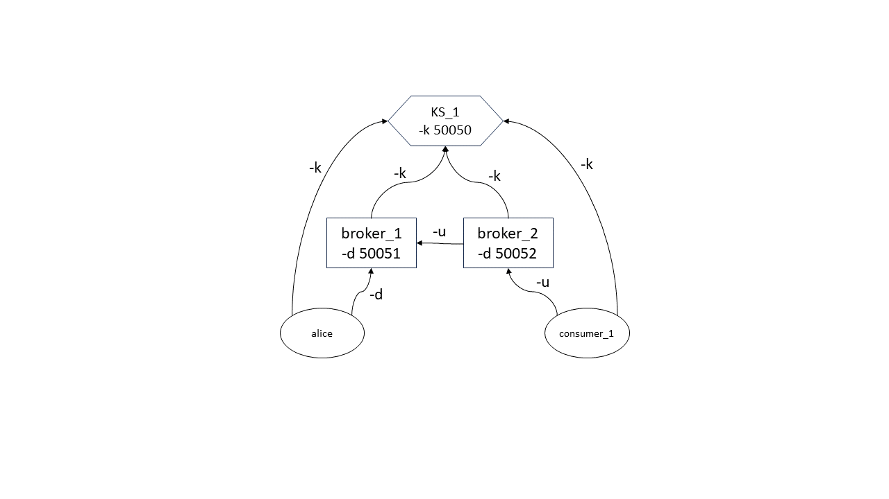
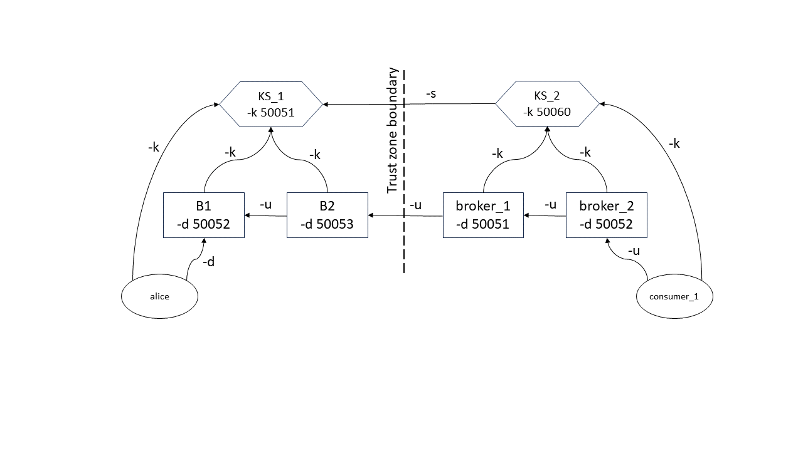

# Running The Examples

Before running the examples, copy the `demoData` folder into the build
directory (required by some examples).


## Multihop PRE Network Examples [all verified as working]

---------------

### PRE Network For AES Key Distribution Demo with multiple brokers using Google RPC

This example allows for PRE between a producer and consumer through
multiple broker hops in multiple trust zones. Each broker either
reencrypts for a broker (self) if the re-encrypted ciphertext is being
passed on to another broker, or re-encrypts to the consumer's key if
the re-encrypted ciphertext is being passed on from the broker to a
consumer. The number of brokers that can be used depends on the
security model and the parameters. The multihop example can be run
either using the single file implementation (`pre.cpp`) or the
multiple process implementation using `gRPC`.

The gRPC demo example demonstrates an application to distribute
sensitive data such as symmetric keys from producers to consumers. A
single trusted server in the first trust zone generates OpenFHE Crypto
Contexts for trusted key servers in other trust zones, producers,
consumers and brokers. Producers and consumer generate their own keys
pairs and the key server in each trust zone generates the key pair for
brokers in its trust zone. It also includes an example of denying
access to unauthorized consumers. Note that the broker cannot decrypt
the ciphertexts sent to them.

The demo requires additional third party applications to be installed:

* `tmux`
* `mpv`
* `openssl` (should be installed in most linux distros). 
* `zenity` (should be installed in most linux distros). 

> `sudo apt-get install tmux`

> `sudo apt-get install mpv`

#### Running the demoscript using the tmux terminal multiplexor

To run the demo, build the example by following instructions under "Building"

1. copy the `demoData` directory found in the root directory and it's
   contents to the `build` directory
   
   >`cp -rf demoData build`

1. Many of our demonstrations involve multiple windows using
   `tmux`. Open a new terminal window in the `build\bin` directory,
   expand it to a large size, and type

> `tmux`

to open the multiple terminal windows that will show the various
   component printouts.
   
1. In another window cd to the `build` directory of this repo and type

   > `../demos/demoscript_pre_grpc.sh`

1. Within the multiple windows you will see the following steps occur:
   1. The Producer generates an AES key and encrypts a video (displayed)
   1. The Server generates an OpenFHE Crypto Context CC. 
   1. The Brokers requests the CC from the Server and the Server generates a
      key pair for each broker.
   1. The Producer requests the CC and sends its key pair to the Server and
      ciphertext (encrypted AES key) to its downstream broker. The broker 
      reencrypts the ciphertext and caches it.
   1. The Consumer requests the CC, sends its public key to the Server and 
      requests a ciphertext for a specific channel from its upstream broker.
   1. The broker requests for a reencryption key and the public key of
      its upstream broker from the server. This is done recursively
      until a broker connected to the producer is reached and the
      requested ciphertext is passed along the chain of brokers to the
      consumer. Each broker in the chain cache the ciphertext
      reencrypted to its own key.
   1. The Consumer decrypts the AES key using their private key
      then decrypts the media using the AES key (displayed).
   1. A new unauthorized Consumer then requests for the ciphertext
      from a channel to its upstream broker. This broker receives an
      empty re-encryption key from the server and a garbage
      ciphertext.
   1. The server, not recognizing the new Consumer, responds with a
      bogus empty key to the upstream broker and the consumer receives
      a garbage ciphertext.
   1. The unauthorized Consumer then tries to decrypts the encrypted
      AES and fails (error shown). Click on the error window to dismiss it.
   


The script is timed so events can be seen occurring
sequentially with built in pauses. It can also run interactively by
adding the '-i' parameter after the script command:

> `../demos/demoscript_pre_grpc.sh -i`

If you see an error `Cannot load libcuda.so.1` you can ignore it. It is from the `mpv` video display program.

Other parameters include:

> `-i (internactive mode on)`

> `-m (security model) INDCPA|FIXED_NOISE_HRA|NOISE_FLOODING_HRA|NOISE_FLOODING_HRA_HYBRID`

> `-s (ssl on)`

> `-h (help)`


A simple access control is emulated using an Access Map file (here
`demoData/accessMaps/pre_accessmap`) that is a white list of all
authorized consumers. This needs to be passed as a command line
argument with the `-a` flag to the key server. If a consumer is not in
the white list, then it is considered unauthorized.  In the above
example When an unauthorized consumer named `charlie` requests for
ciphertext from `broker_2`, the broker receives an empty reencryption
key and the consumer receives a random garbage ciphertext.

Once the consumer and producer are finished, the server
and the brokers remain running.  The producer and consumer programs
can be run again and again.

#### Running the modules manually

The example demo can also be run manually in multiple terminals. The
following flags apply to the different processes `pre_server_demo`,
`pre_broker_demo`, `pre_producer_demo` and `pre_consumer_demo`.

```
   -n process_name -> client_name
   -k key_sever_socket_address
   -d broker_socket_address
   -u upstream_broker_socket_address
   -i upstream_broker_name
   -s upstream_server_name
   -a access_map_file
   -c channel_name (producer_name-consumer_name)
   -m security_mode (INDCPA, FIXED_NOISE_HRA, NOISE_FLOODING_HRA, NOISE_FLOODING_HRA_HYBRID) [required]
```
**Manual example 1:**

This is a manually configured example with two brokers, where `consumer_1` is connected to
`broker_2`, `broker_2` is connected to `broker_1` and producer `alice` is connected
to `broker_1`. The channel from `consumer_1` to producer `alice` is



> `alice -> B1 -> B2 -> consumer_1`

Before running be sure to delete all `*.txt` files from `bin` that may be left over
from prior runs before running. Also remove any previous run's consumer keys with

> `rm demoData/keys/consumer_aes_key_alice-consumer_1` 

First generate alice's dummy AES key used for her data payload:

> `cp ../demoData/keys/producer_aes_key_P0 demoData/keys/producer_aes_key_alice`

then execute the following in separate terminals. 

> `bin/pre_server_demo -n KS_1 -k localhost:50051 -a demoData/accessMaps/pre_accessmap -m INDCPA -l .`

> `bin/pre_broker_demo -n B1 -k localhost:50051 -d localhost:50052  -m INDCPA -l .`

> `bin/pre_broker_demo -n B2 -k localhost:50051 -u localhost:50052 -m INDCPA -i B1 -d localhost:50053 -l .`

> `bin/pre_producer_demo -n alice -k localhost:50051 -d localhost:50052 -m INDCPA -l .`

> `bin/pre_consumer_demo -n consumer_1 -k localhost:50051 -u localhost:50053 -m INDCPA -i B2 -c alice-consumer_1 -l .`

You can then verify that the contents of the `consumer_1`'s received data
is the same as `alice`'s sent data by comparing the content of the files
`producer_aes_key_alice` and `consumer_aes_key_consumer_1` in the
`demoData/keys` folder using the following script:

> `../scripts/verify_pre_output.sh demoData/keys/producer_aes_key_alice demoData/keys/consumer_aes_key_alice-consumer_1` 

Once the consumer and producer are finished, the server
and the brokers remain running.  The producer and consumer programs
can be run again and again.

Note if you see a node terminate with :

```
terminate called after throwing an instance of 'lbcrypto::config_error'
  what():  /home/palisade/opt/openfhe64_1_1_1/include/openfhe/pke/cryptocontext.h:360 Key is nullptr
```

odds are that node is not in the access list and was handed garbage keys as a result. 


**Manual example 2:**

The demo can also be run across multiple trust zones (i.e. multiple
key servers that communicate with each other across the zones, each
serving keys to brokers and producer/consumers within their own
zones). There can also be multiple brokers for each zone, allowing you
to build distribution chains and trees for very large fan-out of
secure data.

To run an example with two trust zones with two brokers in each zone (note the use of a diffferent access map), run the following in multiple separate terminals. 



> `bin/pre_server_demo -n KS_1 -k localhost:50050 -a demoData/accessMaps/pre_accessmap2 -m INDCPA -l .`

> `bin/pre_server_demo -n KS_2 -k localhost:50060 -s localhost:50050 -a demoData/accessMaps/pre_accessmap2 -m INDCPA -l .`

> `bin/pre_broker_demo -n broker_1 -k localhost:50050 -d localhost:50051 -m INDCPA -l .`

> `bin/pre_broker_demo -n broker_2 -k localhost:50050 -u localhost:50051 -i broker_1 -d localhost:50052 -m INDCPA -l .`

> `bin/pre_broker_demo -n broker_3 -k localhost:50060 -u localhost:50052 -i broker_2 -d localhost:50063 -m INDCPA -l .`

> `bin/pre_broker_demo -n broker_4 -k localhost:50060 -u localhost:50063 -i broker_3 -d localhost:50064 -m INDCPA -l .`

> `bin/pre_producer_demo -n alice -k localhost:50050 -d localhost:50051 -m INDCPA -l .`

> `bin/pre_consumer_demo -n consumer_1 -k localhost:50060 -u localhost:50064 -i broker_4 -c alice-consumer_1 -m INDCPA -l .`

Again, you can run the producer and consumers multiple times, and verify the result as shown in the previous manual example.


**Extensions**

These modules are designed to run across networks with multiple IP
domains. If you want to experiment with this you need to replace
`localhost` with actual hostnames, and also (if using SSL) generate
the appropriate certificates.


### Single file PRE implementation -- allows for testing/timing measurment without network overhead.

------------------------------------------------------------------

A single thread implementation that emulates multiple hops for four
different security options can be run using the target `bin/pre`. The
target `bin/pre` has reliable timing using high\_resolution\_clock. This
can be used to verify correct functionality for new parameters sets
without having to launch 100's of brokers in different terminals.

Running the following command runs the pre protocol with IND-CPA
secure parameters and 1 hop by default.

> `bin/pre`

To set the security mode use the flag

`-m #`

where

```
0 = CPA secure PRE,

1 = fixed 20 bits noise (Bounded HRA secure),

2 = provable secure HRA noise flooding

3 = provable secure HRA noise flooding with Hybrid key switching
```


To set the number of hops use
`-d <number of hops>`

Running the following command runs the pre protocol with Provable HRA
secure parameters and 5 hops.  > `bin/pre -m 2 -d 5`


## Threshhold Network using Google RPC 

The Threshhold Network example is built with the google RPC framework
and generalized to any number of clients. GRPC also allows
authenticated connections between the clients and server using
ssl. The folder in which the certificate files are generated (usually
the build folder) is passed as a command line argument to the server
and the client targets to establish a secure channel for
communication.

### Manual example

Remember to generate certificates for these demos:

> `sh ../scripts/authentication/create_nodes_cert.sh threshnet_aborts_demo`

And to run the various components (manually) in different windows in
the `build` directory. 

Running the Server: 

> `bin/thresh_server -n KS -i localhost -p 12345 -l <certificate-location>`

Running the clients:

> `bin/thresh_client -n <client_name> -p 12345 -i localhost -d <client_id> -l <certificate-location> -m <total_num_of_parties>`

the -d flag specifies the client id (an integer from 1 to
total\_num\_of\_parties , 

> ` -a specifies to abort this node partway through the run.`

> `	-l specifies the certificate location, `

> `	-n specifies the name of the client, `

> `	-p specifies the port number of the thresh_server_demo,` 

> `	-i specifies the hostname of the server,` 

> `	-m specifies the total number of clients participating in the computation,`

> `	-c for the type of computation (which can be 'add', 'multiply' or 'vectorsum')`


For example to run a set of four clients + server on the same system,
open five terminal windows and cd to build, and in the first enter

> `bin/thresh_server -n KS -i localhost -p 12345 -l .`

and in the next four enter (one for each terminal)

>`bin/thresh_client -n alice -p 12345 -i localhost -d 1 -l . -m 4 -c multiply`

>`bin/thresh_client -n bob -p 12345 -i localhost -d 2 -l . -m 4 -c multiply`

>`bin/thresh_client -n carol -p 12345 -i localhost -d 3 -l . -m 4 -c multiply`

>`bin/thresh_client -n david -p 12345 -i localhost -d 4 -l . -m 4 -c multiply`

The clients each generate a unique cipher text, and the group
generates the sum and product over them.

The correct output for this example would be 

```

Resulting Fused Mult Plaintext: 
( 1 16 81 256 81 16 1 16 256 81 81 24 ... )

 Resulting Fused AddPlaintext: 
( 4 8 12 16 12 8 4 8 16 12 12 10 ... )

```

Remember to delete the intermediate files generated with 

	> `rm -f server_*.txt client_*.txt`

The Threshnet example also allows to run the aborts protocol when one
or more of parties (minority) drops off before decryption. To test
this, we can use the `-a` flag to manually drop off parties. Suppose
there are three clients running, one party can drop off and the other
parties can still complete the distributed decryption process. 

*Note* different threshold schemes allow different numbers of
participants to abort -- please read the appropriate OpenFHE
documentation before experimenting.

### Scripted example

The demoscript runs five clients with and without aborts. The
variable operation in the script can be set to 'add', 'multiply' or
'vectorsum' to run the threshold example with 5 clients with the
corresponding operation. The script can be run as

>`../demos/demoscript_threshnet_grpc.sh`

which has command line parameters:


> `	-i turns iternactive mode on`

> `	-s turns ssl on`

> `	-a turns aborts on for two nodes`

> `	-c computation_name add | multiply | vectorsum`

> `	-t turns taskset runs each party on a separate cpu (for more accurate timing) `

> `	-h help `


However you computer needs to have at least 6 logical cpus to run the script with `-t` enabled.

## Network Adjacent Co-Measurement Client-Server Example with Google RPC (gRPC)

This example utilizes gRPC base Threshold Encryption with a Server node. 
The data flow involves two nodes that send their measurement
(ciphertext) to a third controller (which could be untrusted).

In order to use ssl we need to create certificates for the two nodes by running (in the `build` directory):

> `sh ../scripts/authentication/create_nodes_cert.sh adjacent_network_measure_with_controller`

The example can be run using the shell script
`../demos/demoscript_adjacent_network_measure.sh`

with the following command line parameters: 

> `	-i turns iternactive mode on`

> `	-s turns ssl on`

> `	-d different measurments (default is the same measurement`

> `	-h help `


We have four test files (`threshnet_input_file_same_1`,
`threshnet_input_file_same_2`, `threshnet_input_file_diff_1`,
`threshnet_input_file_diff_2`). The files with `*_same_*` for the two
clients have the same data and the files with `*_diff_*` have
different data for the two clients.

### Command line parameters

The following are used by the server `bin/thresh_server_measure`, controller `bin/thresh_controller_measure` and clients `bin/thresh_client_measure`:

`-n` specifies the name of the party (in our example KS, Controller, Node1 and Node2 (required for ssl)

`-Wssloff` specifies running the protocol without `ssl` authentication (must be the same setting for all parties)

`-l` specifies the certificate location, if SSL is used.

`-i` specifies the hostname of the server

`-p` specifies the port number of the server

For the controller and two clients: 

`-m` specifies the total number of clients participating in the computation

`-o` specifies the controller socket address as hostname:port

`-s` specifies the session id

For the two clients:

`-d` flag specifies the client id (an integer from 1 to
`total_num_of_parties` 

`-f` specifies the file location of the client's data

For example: 

> `bin/thresh_server_measure -n KS -i localhost -p 50000 -Wssloff`

> `bin/thresh_controller_measure -n Controller -i localhost -p 50000 -o localhost:50051 -m 2 -s 1 -Wssloff`

> `bin/thresh_client_measure -i localhost -p 50000 -o localhost:50051 -d 1 -n Node1 -m 2 -s 1 -f demoData/threshnet_input_file_same -Wssloff`

> `bin/thresh_client_measure -i localhost -p 50000 -o localhost:50051 -d 2 -n Node2 -m 2 -s 1 -f demoData/threshnet_input_file_same -Wssloff`

## Peer to Peer network communication (using gRPC)

In this framework, each individual node communicates with all other
nodes as peers. All peer to peer communications is done through the
`node` object which internally acts as both GRPC client and server. Each
node connects to another node based on rules specified in a Network
map, which is provided as input while launching each node in the
terminal. The `node` object also maintain a message queue for each of the
other nodes it is allowed to connect to, as specified in the network
map. They can then send or get messages to and from these message
queues as needed for applications built on top of this
framework. 

The `testnode.cpp` target file is to test the different methods
defined for the Node service. The `networkmeasure.cpp` file runs a
network measurement protocol between two nodes (launched as two
instances of the target with the appropriate parameters).

The network map format is the following: suppose we have nodes 1,2 and
3 where 1 connects to 2 and 3, 2 connects to 1 and 3 and 3 connects to
1 and 2. This is specified in the network map as:

```
Node1-Node2@localhost:50052,Node3@localhost:50053
Node2-Node1@localhost:50051,Node3@localhost:50053
Node3-Node1@localhost:50051,Node2@localhost:50052
```
### P2P test scripts

The example network map in this repo NetworkMap.txt specifies such a
map for 5 nodes to run with testnode.

Copy the demoData folder into the `build` directory. 
If you wish to use `ssl`, then create certificates by running 
the following command in the terminal from the
`build` directory:

> `sh ../scripts/authentication/create_nodes_cert.sh p2p_testnodes_demo`


Then run from the  `build` directory:

> `../demos/demoscript_p2p_testnodes.sh`.

which has the followign command line options

> `	-i turns iternactive mode on`

> `	-s turns ssl on`

> `	-h help `

The individual command line parameters for `testnode` are 

> `bin/testnode -n <node_name> -s <socket_address> -m <network_map_file_path> -Wssloff`

with command line flags:

`-n node_name`

`-s socket address of node`

`-m location of network map file`

`-f location of application input file`

`-l location of ssl certificates (or use -Wssloff to disable ssl)`

Example for running a node named 'Node1': 

> `bin/testnode -n Node1 -s localhost:50051 -m ../NetworkMaps/NetworkMap.txt -Wssloff`

Another test script runs four nodes and broadcasts data from node 1 to the other nodes to test the broadcast function. 

> `demos/demoscript_p2p_testbroadcast.sh`

which also has `-i` andd `-s` as command line parameters.

### Threshnet with aborts demo (P2P version)

A threshold network with aborts example (described previously in the gRPC
client/server setting has been implemented in the peer-to-peer
framework, eliminating the need for a server to route messages between the
nodes. 

It uses the same certificates as the `threshnet_aborts_demo`

run in the `build` directory

> `../demos/demoscript_threshnet_p2p.sh` 

it has the same command line parameters as  `threshnet_aborts_demo`.

The individual command line parameters to `bin/thresh_aborts_client` are slightly different from the gRPC version since they also have to support node parameters.
All application parameters are encoded in the `-e` flag 

> `-e for the computation to process add|multiply|vectorsum or to abort concatenate -abort to abort this node before sending the partial ciphertext, i.e. add-abort`

For example 

> `bin/thresh_aborts_client -n Node1 -s localhost:50051 -m ../NetworkMaps/NetworkMap_threshnetaborts.txt -f demoData/threshnetdemo_input_file -e multiply -Wssloff`

## Network Adjacent Co-measurement Example (P2P)

This is a peer-to-peer version of the Network Adjacent Co-measurement
example where the two nodes do not need a controller.  The example can
be run by running the shell script
 
>  `../demos/demoscript_p2p_adjacent_network_measure.sh` 

which has the same command line parameters as the gRPC version.

The network measure example with controller also can be run with peer
to peer framework as follows. In `build` generate certificates (if using ssl).

> `sh ../scripts/authentication/create_nodes_cert.sh adjacent_network_measure_with_controller_p2p`

then run 
> `../demos/demoscript_p2p_adjacent_network_measure_controller.sh`

which has the same command line parameters as the non-controller version.


## Network Path Measurment Example (P2P)

The Path measurement example allows for computation of some statistics
(such as mean, squares of mean and cubes of mean as of now) by
accumulating encrypted data along a path of nodes.  Each node in the
path accumulates four values into a length four vector (here n, n^2, n^3 and 1 where n is the node number in the path 1,2,3). The result is sent to a trusted
controller, who passses the result back up the path for each node to partially decrypt.
The controller receives the partial decryption shares for final decryption and computes  the average of each element in the total result (using the fourth value to determine the total number of inputs). The same ciphertext is used to accumulate data from
multiple nodes (a vector treated as a register). 

The certificates for ssl mode can be generated by running 

 > `../scripts/authentication/create_nodes_cert.sh path_measurement`
 
 in the `build` directory.


The example with three nodes and a controller can be run using the
shell script `../demos/demoscript_p2p_path_measurement.sh`

which also has `-i` and `-s` as command line parameters.


To run the example without the script, run the following commands from
the `build` directory:

> `bin/controller_statistics -n Controller -s <socket_address> -m <network_map_file_path> -Wssloff`

> `bin/network_statistics -n <node_name> -s <socket_address> -m <network_map_file_path> -f <input_file_path> -Wssloff`

For a controller and three nodes, the example run would be the following commands:

> `bin/controller_statistics -n Controller -s localhost:50054 -m ../NetworkMaps/NetworkMap_statisticscompute.txt -Wssloff`

> `bin/network_statistics -n Node1 -s localhost:50051 -m ../NetworkMaps/NetworkMap_statisticscompute.txt -f demoData/threshnet_input_file -Wssloff`

> `bin/network_statistics -n Node2 -s localhost:50052 -m ../NetworkMaps/NetworkMap_statisticscompute.txt -f demoData/threshnet_input_file -Wssloff`

> `bin/network_statistics -n Node3 -s localhost:50053 -m ../NetworkMaps/NetworkMap_statisticscompute.txt -f demoData/threshnet_input_file -Wssloff`


